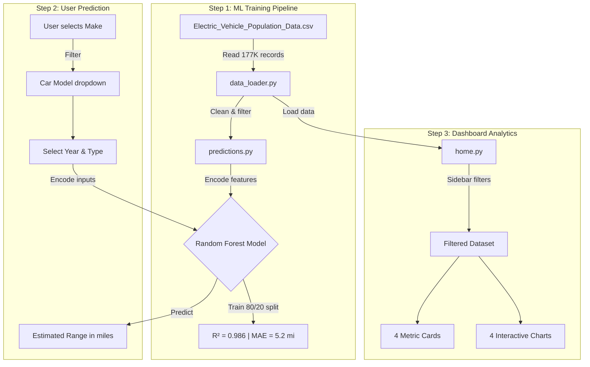

# 🔋 EV Insights


ML-powered dashboard that predicts EV range and visualizes **177K+ electric vehicle records** from Washington State DOL. Random Forest model achieves **R² = 0.986** with **5.2 mile** average error.

---

**🌐 [Try it Live](https://ev-insights.streamlit.app/)** - No installation required

## 🔄 How It Works



---

## 🚀 Quick Start

```bash
git clone https://github.com/Deekshith06/EV-Range-Estimation-Insights-Dashboard.git
cd EV-Range-Estimation-Insights-Dashboard
python -m venv .venv
source .venv/bin/activate  # Windows: .venv\Scripts\activate
pip install -r requirements.txt
streamlit run app.py
```

> Download [Electric Vehicle Population Data](https://catalog.data.gov/dataset/electric-vehicle-population-data) CSV into the project root before running.

---

## 📂 Project Structure

```
├── app.py              # Entry point + dark theme
├── data_loader.py      # Data loading & cleanup
├── pages/
│   ├── home.py         # Dashboard (filters, metrics, charts)
│   └── predictions.py  # ML range estimation
├── requirements.txt
└── .gitignore
```

---

## 🔧 Tech Stack

| Component | Technology |
|-----------|------------|
| Frontend | Streamlit, Plotly |
| ML Model | Scikit-learn (RandomForest) |
| Data | Pandas, NumPy |

---

## 📊 Model Performance

| Metric | Value |
|--------|-------|
| R² Score | 0.986 |
| MAE | 5.2 miles |
| Features | Model Year, Make, Vehicle Type |
| Training Data | 85K+ records |

---

## 👤 Author

**Seelaboyina Deekshith**

[](https://github.com/Deekshith06)
[](https://www.linkedin.com/in/deekshith030206)
[](mailto:seelaboyinadeekshith@gmail.com)

---

> ⭐ Star this repo if it helped you!
